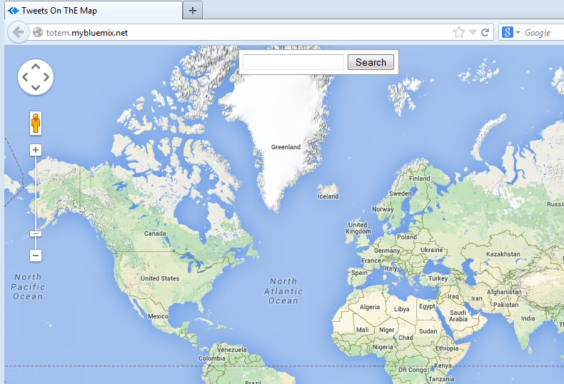
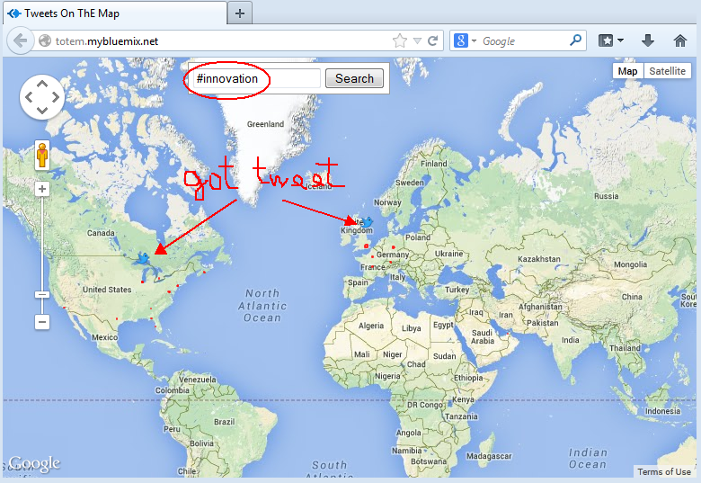
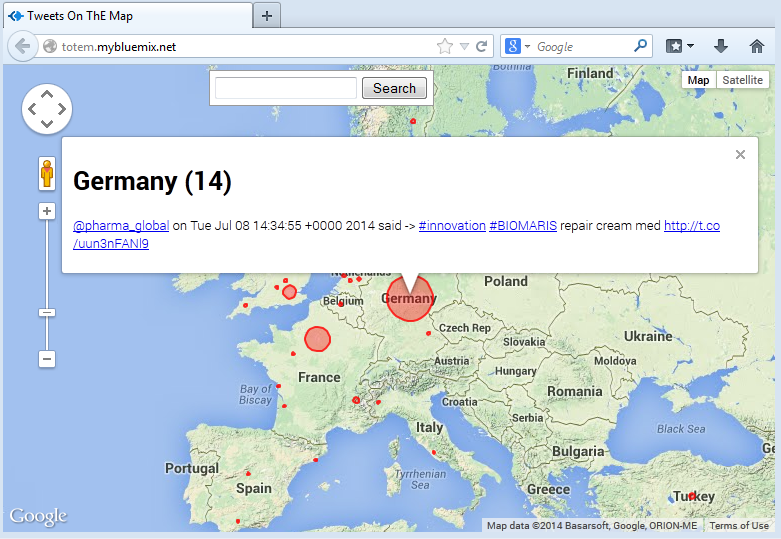

# Tweets On ThE Map (Totem)

Totem is a web application using *WebSockets*, *Twitter Search*, and *Google Maps* API
to show in real-time the *world of tweets* on a Google map.  


## Usage

Push the app to **IBM Bluemix** (see [Hosting the app](#hosting-the-app)), and connect to the URL (e.g. https://your-totem.mybluemix.net/).  
You should get a map with a top-centered search box:  
  
  
  
Write a twitter search and hit the Search button.
If you queried for frequently-twitted topics (e.g. #innovation),
you should soon see the map start populating with `red circles` and `bouncing tweets` like
the example in the picture below.  
  
  
  
The radius of the circles increases as more tweets come from the location.  
New tweets are announced by `bouncing tweets`.  

By clicking on a circle you can view the location name, the total number of tweets since
you started the search, and the last tweet.  
  
  
  
You can have fun with composing queries since the *Twitter Search API* is very powerful.
See [Using the Twitter Search API](https://dev.twitter.com/docs/using-search) to believe that.
These are examples of queries you can compose:  

```
@ibmbluemix 				referencing account "ibmbluemix".
bluemix since:2010-12-27 	containing "bluemix" and sent since date "2010-12-27" (year-month-day).
bluemix ? 					containing "bluemix" and asking a question.
```


## <a name="hosting-the-app">Hosting the app</a>  

You can run the app locally or you can host it on IBM Bluemix (or any other PaaS supporting WebSocket protocol).
In both cases do the following:  

1. Install [Node.js](http://nodejs.org/)  

2. Get the code cloning the git repository https://hub.jazz.net/git/mcrudele/totem using your preferred Git client  

3. Run the `npm install` command from the root folder of the app, which contains the `package.json` file.  
   This installs the dependencies in the `node_modules` directory  

4. Apply the quick fix described below to [fix the ntwitter package](#fix-ntwitter)  

5. Create a Twitter account and generate your *Twitter access tokens and API Keys*.  
   Read about [how to get my api key](https://dev.twitter.com/discussions/631) if you are not familiar with Twitter API usage
   or go directly to the [Twitter Application Management](https://dev.twitter.com/apps).  


### Hosting locally

You are a step away for testing the app locally. You just need to provide your Twitter access tokens and API Keys
into the environment variable `TWITTER_KEYS`, run the command `node app.js`, and point your browser to http://localhost:3000/.  

```
export TWITTER_KEYS = '{"consumer_key":"CHANGE_ME","consumer_secret":"CHANGE_ME","access_token_key":"CHANGE_ME","access_token_secret":"CHANGE_ME"}'
node app.js
```

Note that `consumer_key` and `consumer_secret` attributes are the `API Key` and the `API Secret` taken from the Twitter Application Settings page.  


### Hosting on IBM Bluemix

Hosting the app on IBM Bluemix is as easy as running it locally. You still need to provide the `TWITTER_KEYS` environment variable,
but in the `manifest.yml` file this time. So, once created a Bluemix account and downloaded the `cf` command line, do the following:  

1. Edit the `manifest.yml.change_me` file located on the root directory of the app as follows, and rename it to `manifest.yml`.  
   Set the `host` (e.g. your-totem) attribute and fill in the TWITTER_KEYS as described in the previous section:  
   
```
  ---
  applications:
  - name: totem
    memory: 512M
    domain: mybluemix.net
    instances: 1
    host: CHANGE_ME
    path: .
    env:
      TWITTER_KEYS: '{"consumer_key":"CHANGE_ME","consumer_secret":"CHANGE_ME","access_token_key":"CHANGE_ME","access_token_secret":"CHANGE_ME"}'
```
   
2. Edit the `package.json` file located on the root directory of the app and remove the `ntwitter` module
   from the dependencies so it gets uplodaed from the local directory when you push to Bluemix.  
   
   `This ugly step is needed to retain the fix you did to the ntwitter package, otherwise overridden
   by Bluemix automatically installing the dependency when staging the app.`  
   
3. Run the `cf push` command from the root directory of the app and connect your browser to https://your-totem.mybluemix.net/


## <a name="fix-ntwitter">Fix the ntwitter package</a>  

There is a bug in the `ntwitter` npm package not using the latest endpoint for
Twitter Search API. You need a couple of fixes (unfortunately not yet merged in the project stream).  
Once installed the dependencies of the `totem` project using the `npm install` command, you should
find the `node_modules` directory on your root folder.  
`cd node_modules/ntwitter` and apply the following changes:  

```
lib/keys.js

<     search_base: 'http://search.twitter.com',
---
>     search_base: 'https://api.twitter.com/1.1/search',
```

```
lib/twitter.js

<   var url = this.options.search_base + '/search.json';
---
>   var url = this.options.search_base + '/tweets.json';
```

After this change you are able to run the `totem` app.  


## Developing

### Tools

The application is written in [Node.js](http://nodejs.org/) using the [Express](http://expressjs.com/) web application framework.  

Other tools used:  

- [ws: a node.js websocket library](https://github.com/einaros/ws) npm package for dealing with WebSockets  
- [ntwitter: asynchronous twitter client api for node.js](https://github.com/AvianFlu/ntwitter) npm package for searching Twitter  
- [Google Maps JavaScript API V3](https://developers.google.com/maps/documentation/javascript/reference).  
